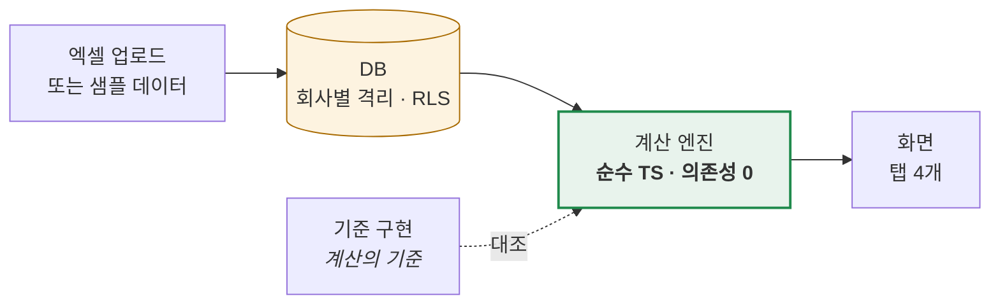
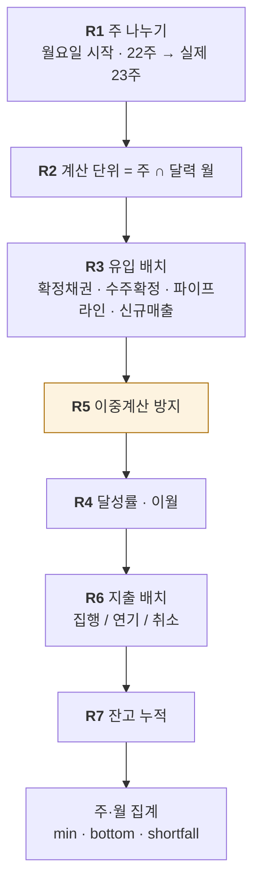
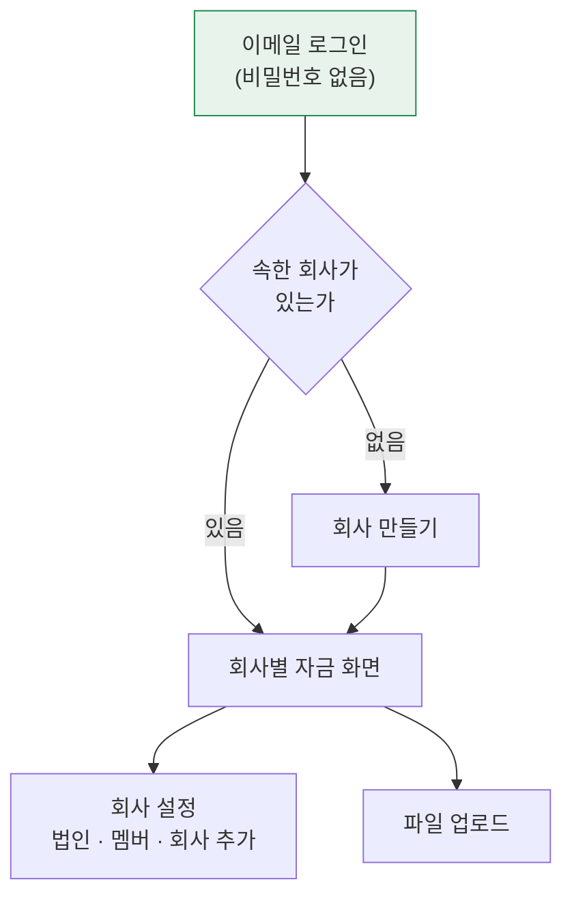
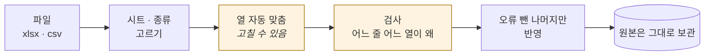

# 자금관리

> **"현금이 언제 바닥나는가"** 에 답하는 웹앱. 업체별로 로그인해 쓰는 주간 자금 현황·런웨이 도구.

```
엔진 테스트 88   화면 테스트 21   커버리지 99%
```

로그인 → 회사 만들기 → **샘플 데이터로 둘러보기** 또는 **영업관리 파일 올리기** → 런웨이 확인

---

## 1. 한 장으로 보는 구조



**엔진을 따로 뺀 이유** — 화면·서버·테스트가 *같은 함수* 를 부르게 하려고. 숫자가 화면마다 다르면 회의가 멈춘다.

| 규칙 | 왜 |
|---|---|
| React·DB·`fetch` 를 import 하지 않는다 | 어디서든 같은 값이 나와야 한다 |
| **기준일도 인자다** (`Date.now()` 금지) | 지난주 회의 화면을 그대로 재현 |
| 금액은 **정수 원** | float 누적은 잔고를 밀리게 한다 |

> `test/purity.test.ts` 가 이걸 강제한다. 외부 import·`Date.now()`·`localStorage` 가 들어오면 실패.

---

## 2. 계산은 이렇게 흐른다



**R2 가 핵심**: 주를 그대로 쓰지 않고 **달력 월 경계로 한 번 더 쪼갠다.**

```
8월 마지막 주 (8/31 ~ 9/6)
├─ 8/31          ← 8월 칸   (8월 고정비가 여기로)
└─ 9/1 ~ 9/6     ← 9월 칸   (9월 임차료가 여기로)
        ↑ 안 쪼개면 9월 임차료가 8월에 잡힌다
```

---

## 3. 개발 회고

날짜별로 `docs/retrospective/` 에 쌓는다. 각 회고는 **개발자용**(코드·판단 근거)과 **쉽게 보기**(도식 위주) 두 부분으로 나뉜다.

| 날짜 | 무엇을 했나 |
|---|---|
| [2026-09-06](docs/retrospective/2026-09-06.md) | 계산 엔진 이식 · 골든 테스트 · 읽기 전용 화면 |
| [2026-09-07](docs/retrospective/2026-09-07.md) | 로그인·멀티테넌시 · 파일 업로드 · 배포 |

여기서 잡은 결함 10건의 요약:

| # | 무엇 | 어디서 잡았나 |
|---|---|---|
| 1 | 연령분석이 잔액이 아닌 매출액 기준 (수백 배) | 골든 테스트 |
| 2 | 문서의 기초잔액 오기 | 기준값 재현 시도 |
| 3 | 이중계산 차감이 통째로 소멸 | 규칙 재검토 |
| 4 | float 누적으로 잔고가 밀림 | 기준 구현 대조 |
| 5 | 회수예정일 없는 돈을 기간 끝에 배치 | 규칙 재검토 |
| 6 | 달성률 기본값이 0% (최악 시나리오로 열림) | **스크린샷 육안** |
| 7 | 기준주차가 빈 주 | **스크린샷 육안** |
| 8 | 진행률 기준 오류 | 기준 구현 대조 |
| 9 | URL 법인 필터 복원 실패 | 화면 테스트 |
| 10 | 표 중복 key | 코드 리뷰 |

---

## 4. 커버리지가 말해준 것

처음엔 골든 테스트가 전부 통과했지만 **연기·취소 경로는 한 번도 안 돌았다.**

```mermaid
xychart-beta
    title "구문 커버리지 (%)"
    x-axis ["지출 배치", "유입 배치", "연령분석", "전체"]
    y-axis "%" 0 --> 100
    bar [63, 97, 100, 94]
    bar [100, 100, 100, 99]
```



<sub>앞 = 기본 골든 테스트만 있을 때 · 뒤 = 시나리오·규칙 테스트 추가 후</sub>

**"골든 테스트 통과 = 문제 없음" 이 아니었다.** 그래서 지금은 **절대값과 불변식을 같이** 본다.

| 절대값 (스냅샷에서 읽음) | 불변식 (코드에 남음) |
|---|---|
| 총유입 = N원 | 기말 = 기초 + 유입 − 유출 |
| 최저 잔고 = N원 | 달성률↓ → 유입↓·이월↑ |
| 버킷별 잔액 | 6버킷 합계 = 채권 총액 |
| 주별 이동액 | 기간 내 이동은 총액 불변 |

절대값만 보면 "왜 이 숫자여야 하는지" 를 잊는다. 불변식은 데이터가 바뀌어도 남는다.

---

## 5. 멀티테넌시 — 배포 URL 이 아니라 앱이 막는다

배포 플랫폼의 접근 제한은 유료 기능이라, 공개 URL 에 데이터가 그대로 노출될 수 있었다.
**앱에 로그인을 붙여 해결했다.** URL 이 공개여도 회사에 속한 사람만 데이터를 본다.



스키마에 `org_id` 와 RLS 는 처음부터 있었는데, **회사를 만들 경로가 없었다** — `organizations` 에 INSERT 정책이 없어서 첫 회사를 만들 방법 자체가 없었다.
회사 생성과 소유자 등록이 한 트랜잭션에서 같이 일어나야 해서, 정책 대신 함수로 열었다.

---

## 6. 파일 업로드 — 자동으로 맞추되, 사람이 고칠 수 있게

부서마다 양식이 조금씩 다르다. 헤더 이름으로 자동 추측하되 **틀렸으면 고칠 수 있게** 했다.



**자동 추측이 확실하지 않으면 비워 둔다.** 틀린 채로 넣는 것보다 사람이 고르는 게 낫다.
원본 행을 그대로 남기므로, 파싱 규칙이 바뀌면 다시 돌릴 수 있다.

검사 항목: 필수값 누락 · 날짜 형식 · 숫자 아님 · 없는 법인 · 증빙번호 중복 · 배분 합 ≠ 100% · 받은 금액 > 청구금액 · 연기인데 날짜 없음

---

## 7. 추측하지 않고 비워 둔 것

데이터에 없는 값을 **항목 이름으로 추측하지 않는다.** 화면에 「미기재」로 두고 왜 비었는지 적는다.

| 칸 | 왜 비어 있나 |
|---|---|
| 지출 성격 | 제출 양식에서 받아야 하는 값 |
| 허가상태 | 〃 |
| 계정과목 | 〃 |

숫자를 지어내는 것보다 비어 있는 게 낫다. 회의에서 틀린 숫자 하나가 나오면 나머지도 못 믿는다.

---

## 8. 구조

```
apps/web/                     Next.js 15 · 로그인 · 회사 설정 · 업로드 · 탭 4개
packages/cashflow-engine/     ★ 계산 엔진 (순수 TS, 의존성 0)
  ├─ src/                       R1~R8
  ├─ scripts/make-fixture.mjs   샘플 데이터 생성 (고정 시드)
  ├─ __fixtures__/              샘플 입력 + 기대값 스냅샷
  └─ test/                      골든 · 시나리오 · 규칙 · 대조 · 순수성
supabase/migrations/          21테이블 · RLS · 트리거 · 회사 생성 함수
docs/                         01~06 명세 + 날짜별 회고
legacy/index.html             기준 구현 (계산 대조용)
```

```bash
pnpm install
pnpm -r test                                  # 엔진 88 + 화면 21
pnpm --filter web dev                         # http://localhost:3000
GEN=1 pnpm --filter cashflow-engine test      # 기대값 갱신 (계산을 바꿨을 때만)
```

> 저장소의 데이터는 **전부 가상 샘플**이다. 고정 시드로 생성하므로 누가 돌려도 같은 값이 나온다.

---

## 9. 다음

| 단계 | 상태 |
|---|---|
| 계산 엔진 | ✅ |
| 읽기 전용 화면 | ✅ |
| 로그인 · 회사별 데이터 | ✅ |
| 파일 업로드 | ✅ |
| 인라인 편집 (집행상태·수주확정 이관) | ⬜ |
| 스냅샷 · 인쇄 · 내보내기 | ⬜ |

> 상세 명세는 [`docs/`](docs/) — [PRD](docs/01-PRD.md) · [기능](docs/02-FUNCTIONAL-SPEC.md) · [데이터 모델](docs/03-DATA-MODEL.md) · [디자인](docs/04-DESIGN-SYSTEM.md) · [**계산 엔진 ★**](docs/05-CALC-ENGINE.md) · [로드맵](docs/06-ROADMAP.md)
