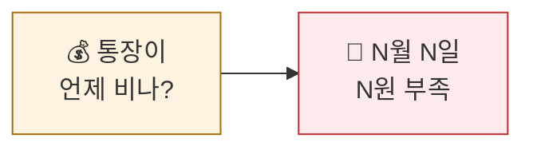
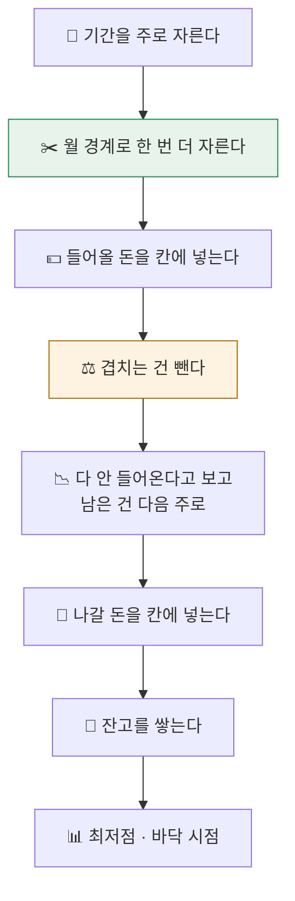
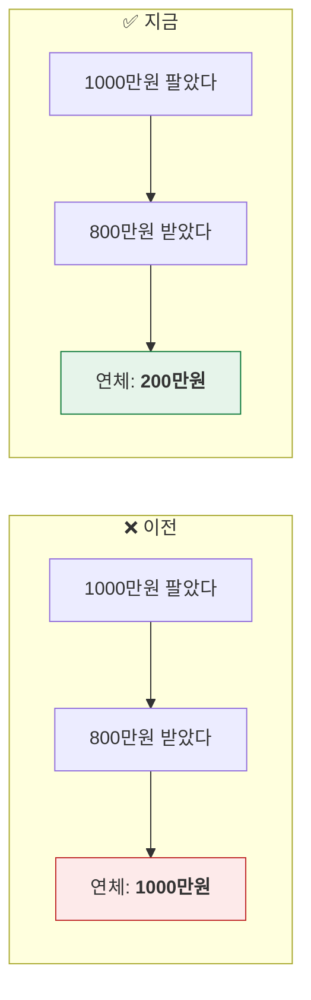
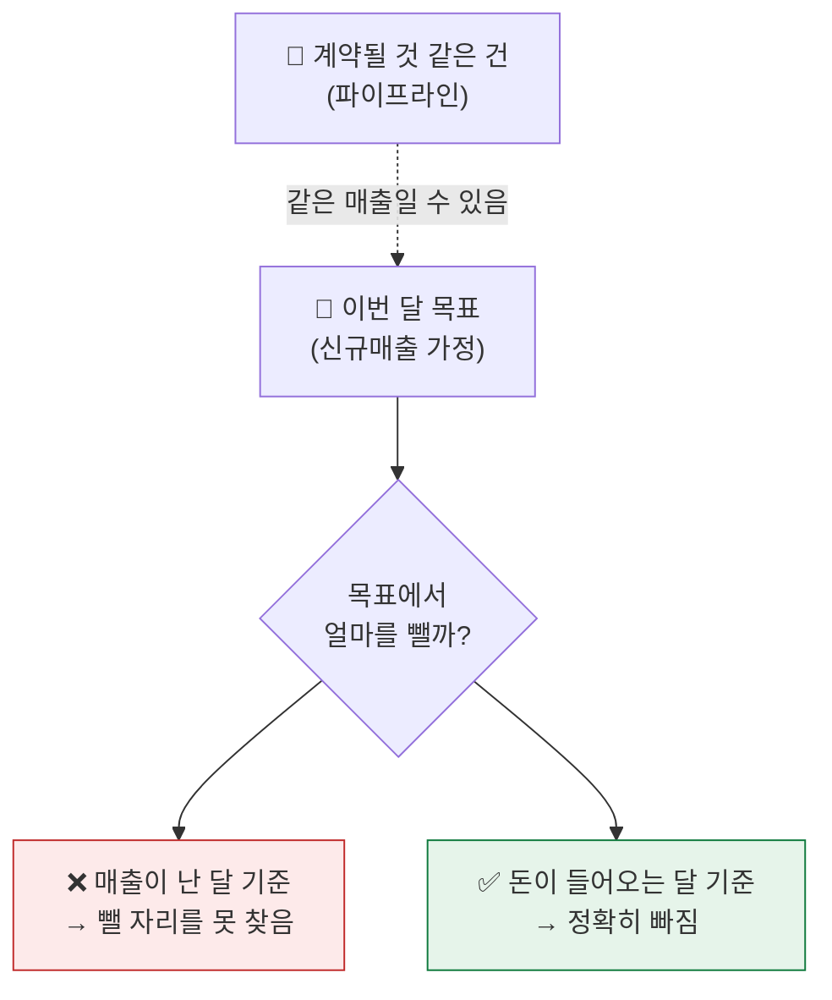
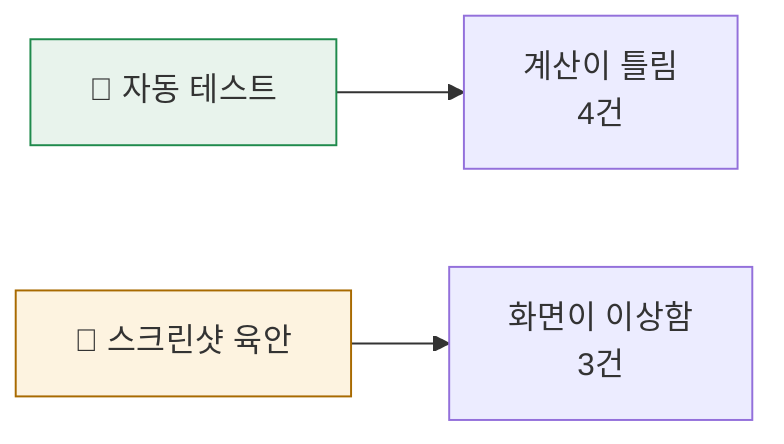
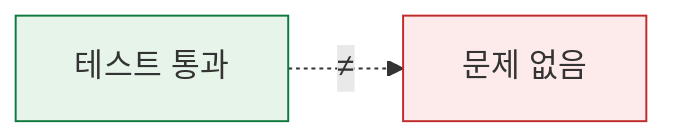

# 2026-09-06 · 계산 엔진 이식과 읽기 전용 화면

---

# 1부 · 개발자용

## 1.1 무엇을 만들었나

단일 HTML 프로토타입의 `run()` 함수를 **의존성 0 인 순수 TypeScript 패키지**로 이식하고, 그 위에 읽기 전용 화면 4탭을 올렸다.

```
packages/cashflow-engine/     R1~R8 · 순수 함수
apps/web/                     Next.js 15 · 탭 4개
```

### 설계 제약

| 제약 | 이유 | 강제 방법 |
|---|---|---|
| React·DB·`fetch` import 금지 | 화면·서버·테스트가 같은 함수를 부른다 | `purity.test.ts` 가 소스를 정규식으로 검사 |
| `Date.now()` 금지, 기준일은 인자 | 지난주 회의 화면 재현 | 위와 동일 |
| 금액은 정수 원, float 누적 금지 | 잔고가 밀린다 | `money.ts` + 대조 테스트 |

`purity.test.ts` 는 소스 파일을 읽어 주석을 제거한 뒤 금지 패턴을 찾는다. 주석을 안 지우면 "`Date.now()` 를 쓰지 않는다" 는 규칙 문장 자체가 걸린다.

## 1.2 계산 규칙 R1~R8

```
R1 주 나누기 (월요일 시작, 소속 달은 일수 다수결)
R2 계산 단위 = 주 ∩ 달력 월          ← 핵심
R3 유입 배치 (4개 소스)
R5 이중계산 방지
R4 달성률 · 이월
R6 지출 배치 (집행/연기/취소)
R7 잔고 누적
R8 연령분석 (별도 함수)
```

**R2 를 왜 두는가.** 주 단위로만 계산하면 월말에 걸친 주에서 고정비 지급일이 엉뚱한 달에 잡힌다. 그래서 주를 달력 월 경계로 한 번 더 쪼갠 뒤, 결과를 주·월로 다시 묶는다.

```ts
// 8/31 ~ 9/6 한 주 → 두 칸
[{ week: 5, month: '8월', start: 8/31, end: 8/31 },
 { week: 5, month: '9월', start: 9/1,  end: 9/6  }]
```

## 1.3 이식하면서 잡은 결함

### ① 연령분석이 잔액이 아니라 매출액을 나누고 있었다

기존 구현은 「90일 초과」 버킷에 *판 금액 전부* 를 넣고 있었다. 이미 받은 돈까지 연체로 세는 셈이다.

```ts
// ❌ 매출액을 나눔           ✅ 잔액을 나눔
bucket += r.amount_billed;   bucket += r.amount_open;  // 청구 − 받은 금액
```

**수백 배 차이.** 회귀를 막기 위해 불변식을 테스트로 박았다.

```ts
expect(sum(6개 버킷)).toBe(매출채권_총액);   // 어긋나면 실패
```

`stage='청구전'` 은 연령분석에서 제외한다 — 청구도 안 한 건에 연체는 의미가 없다.

### ② 이중계산 방지를 매출월로 맞춰 차감이 소멸했다

파이프라인과 신규매출 가정을 같이 켜면 같은 매출이 두 번 잡힌다. 신규매출 목표에서 파이프라인 기대값을 빼야 하는데, **어느 달에서 빼느냐** 가 문제였다.

```
파이프라인 회수월: 11월, 12월
신규매출 행:      8월분(회수 10월) · 9월분(회수 11월) · 10월분(회수 12월)
                  11월분·12월분은 회수일이 내년이라 기간 밖

❌ 매출월 매칭 → 11월분·12월분을 찾는데 둘 다 배치 안 됨 → 차감 전액 소멸
✅ 회수월 매칭 → 11월→9월분, 12월→10월분 → 정확히 차감
```

맞춰야 하는 축은 **매출이 난 달이 아니라 현금이 들어오는 달**이다.

> 총액만 검증하는 테스트로는 이 버그가 안 잡힌다. 그래서 **달별 배치액을 직접 검증**하는 테스트를 추가했다.

한 회수월의 기대값을 여러 행이 중복 차감하지 않도록 `remaining` 맵으로 소진량을 추적한다. 대응하는 행이 아예 없어 남는 차감분은 배치되는 달에 이른 순서대로 떠넘긴다 — 차감이 사라지면 이중계산이 그대로 남기 때문이다.

### ③ float 누적으로 잔고가 밀렸다

조각마다 반올림하면 누적합이 몇 원씩 밀린다. 화면에서 사람이 읽는 것은 조각이 아니라 잔고다.

```ts
// ❌ 조각마다 반올림 → 오차 누적
parts = ratios.map(r => Math.round(total * r));

// ✅ 누적합을 반올림 → 어느 지점에서도 오차 ≤ 0.5원
let exact = 0, placed = 0;
for (const r of ratios) {
  exact += total * r / sum;
  const upto = Math.round(exact);
  out.push(upto - placed);
  placed = upto;
}
```

같은 원칙을 R4(달성률·이월)에도 적용했다. 이월은 곱셈이 이어지는 점화식이라 끊는 지점이 결과를 바꾼다.

```
실입금ₖ = round(누적계획ₖ − 이월ₖ) − round(누적계획ₖ₋₁ − 이월ₖ₋₁)
```

**엔진만 고치면 기준 구현과 1원이 어긋난다.** 그래서 기준 구현(`legacy/index.html`)의 `run()` 도 같은 규칙으로 정수화했다(5군데). 이제 주별·월별·합계가 원 단위까지 일치한다.

### ④ 회수예정일 없는 돈을 기간 끝에 몰아넣었다

```ts
// ❌ 언제 들어올지 모르는 큰 금액을 마지막 칸에
const due = r.dueDate ? parse(r.dueDate) : horizonEnd;
```

최저점 *뒤* 에 큰돈이 들어와 런웨이가 실제보다 안전해 보인다. 개별 건으로 넣지 않고, 집행률을 곱해 월별 비율로 배분하고 화면에 「추정」이라고 표시하도록 바꿨다.

### ⑤ 화면 버그 — 테스트는 통과했는데 화면이 이상했다

| 증상 | 원인 |
|---|---|
| 첫 화면이 "통장이 바닥납니다" | `Number(params.get('rate') ?? '')` → `Number('')` 은 **0**. URL 에 값이 없으면 달성률 0% |
| 「주간 입금 계획」이 전부 0 | 기준주차 기본값이 이틀짜리 첫 주 |
| 진행률이 실제보다 낮게 | 「청구액」 대비로 계산 (정답은 「계획액」 대비) |

```ts
// ❌ 파라미터가 없으면 0% (최악 시나리오로 열림)
const raw = Number(params.get('rate') ?? '');

// ✅ 없으면 100%
const p = params.get('rate');
const raw = p === null || p === '' ? Number.NaN : Number(p);
const rate = Number.isFinite(raw) && raw >= 0 && raw <= 100 ? raw / 100 : 1;
```

세 번째는 추측하지 않고 기준 구현 코드를 열어 계산 기준을 확인해서 맞췄다.

## 1.4 커버리지가 드러낸 것

골든 테스트가 전부 통과하는 상태에서 커버리지를 재 봤다.

```
지출 배치   63% stmts / 43% branch    ← 연기·취소 경로가 통째로 미실행
```

**"골든 테스트 통과 = 문제 없음" 이 아니었다.** 샘플 데이터가 안 건드리는 규칙(연기·취소, 달성률 이월, 법인 단독)은 코드만 있고 검증은 없었다.

시나리오 테스트를 추가해 99% 로 올렸고, 그 과정에서 절대값만으로는 부족하다는 것도 알게 됐다.

| 절대값 | 불변식 |
|---|---|
| 총유입 = N원 | 기말 = 기초 + 유입 − 유출 |
| 최저 잔고 = N원 | 달성률↓ → 유입↓·이월↑ |
| 버킷별 잔액 | 6버킷 합계 = 채권 총액 |
| 주별 이동액 | 기간 내 이동은 총액 불변 |

절대값만 보면 "왜 이 숫자여야 하는지" 를 잊는다. 불변식은 데이터가 바뀌어도 남는다.

## 1.5 화면

- 탭 4개 · 전역 컨트롤(법인·주월·기준주차·달성률)
- 상태를 URL 에 실어 회의 중 링크로 공유
- 디자인 토큰(라이트/다크), 모바일 390px 가로 스크롤 0

데이터에 없는 값은 **항목 이름으로 추측하지 않고** 「미기재」로 두고 왜 비었는지 화면에 적었다 — 지출 성격·허가상태·계정과목.

---

# 2부 · 쉽게 보기

## 이 앱이 답하는 질문



## 계산은 이렇게 흐른다



## 왜 주를 또 자르나?

```
        8/31(월) ~ 9/6(일)   ← 한 주인데 두 달에 걸침

❌ 안 자르면                    ✅ 자르면
   ┌──────────────┐              ┌──┬───────────┐
   │   한 칸      │              │8월│   9월     │
   └──────────────┘              └──┴───────────┘
   9월 임차료가                   9월 임차료가
   8월에 잡힘                     9월에 잡힘
```

## 가장 큰 실수: 「받을 돈」 대신 「판 돈」



이미 받은 800만원까지 「밀린 돈」으로 세고 있었다.

## 같은 매출을 두 번 세지 않기



## 1원이 밀리는 이유

```
100원을 셋에 나눈다

❌ 조각마다 반올림          ✅ 쌓으면서 반올림
   33 + 33 + 33 = 99          33 + 33 + 34 = 100
        ↑ 1원 증발                  ↑ 딱 맞음
```

돈은 1원도 사라지면 안 된다. 화면에서 사람이 보는 건 **쌓인 잔고**라서 더 그렇다.

## 테스트가 잡은 것 vs 눈이 잡은 것



테스트가 다 초록이어도 **화면을 눈으로 봐야** 보이는 게 있었다.
첫 화면이 최악 시나리오로 열리는 버그는 테스트가 절대 못 잡는다 — 계산은 맞았기 때문이다.

## 커버리지 함정

```
골든 테스트 전부 통과 ✅
        ↓
   커버리지 재보니
        ↓
지출 연기·취소 코드는 한 번도 안 돌았음 😨
```



샘플 데이터가 안 건드리는 기능은 **코드만 있고 검증은 없는** 상태였다.

---

## 이전 작업 수정 이력

이 회고가 첫 기록이라 해당 없음.
