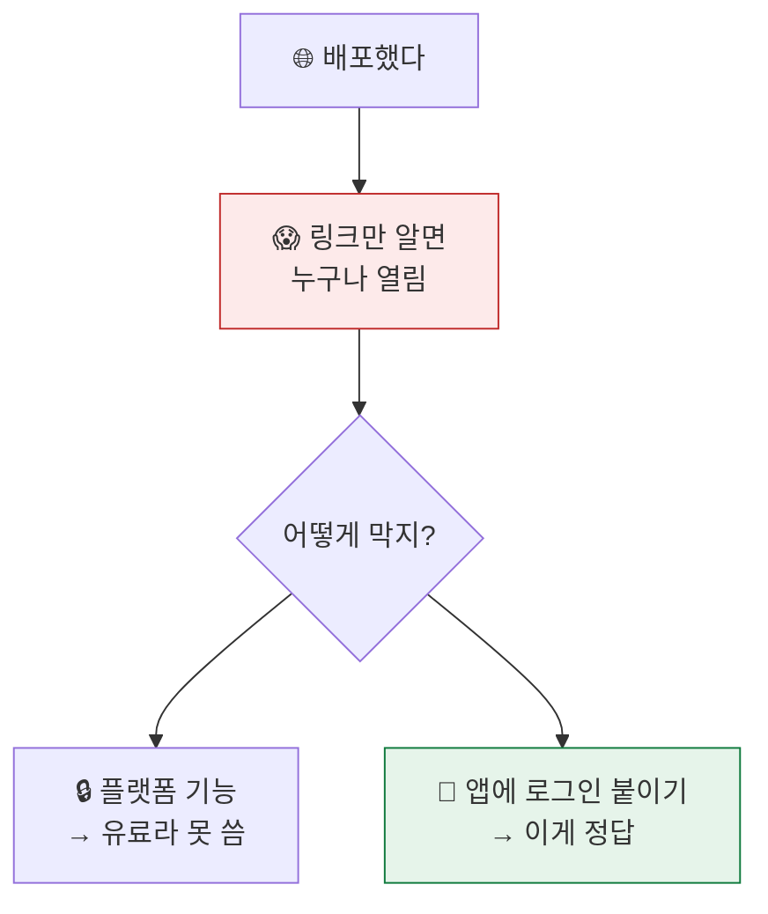
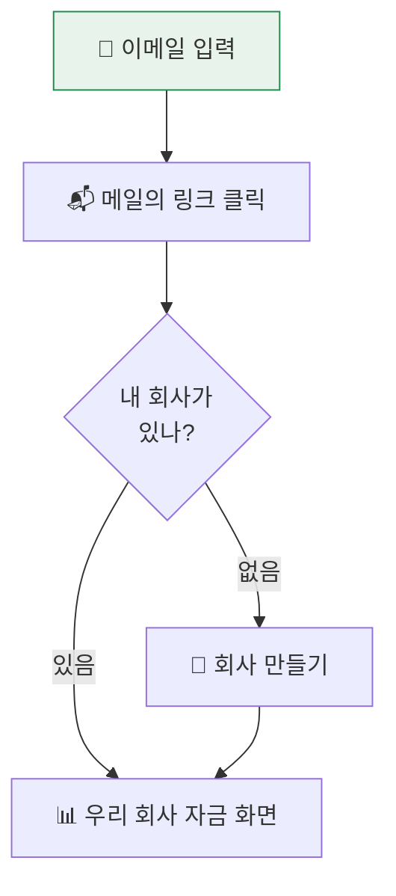
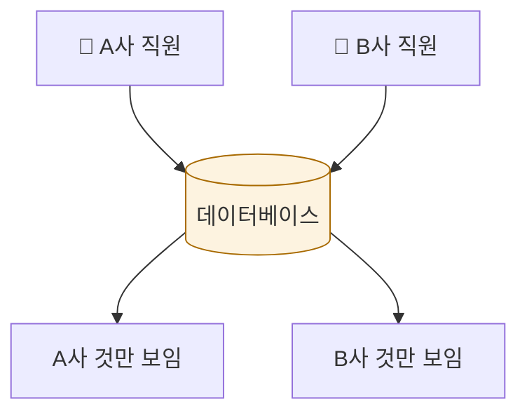
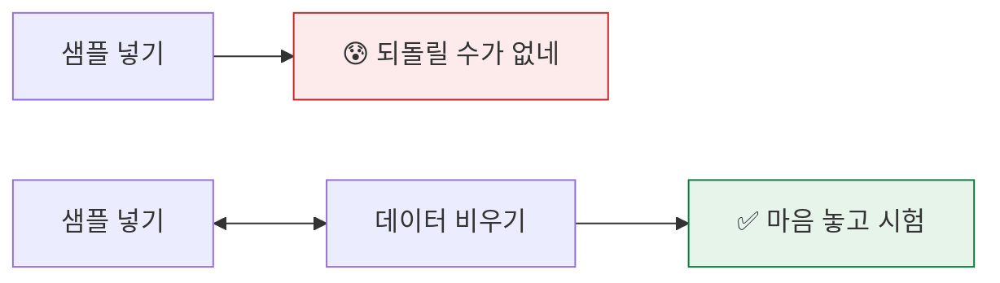

# 2026-09-07 · 로그인·멀티테넌시, 파일 업로드, 배포

---

# 1부 · 개발자용

## 1.1 배포하며 드러난 것 — 배포 URL 은 데이터를 못 막는다

배포 후 공개 URL 이 인증 없이 200 을 돌려주고 화면에 데이터가 그대로 나왔다.

```bash
$ curl -s https://<production-alias> | grep -c "자금 현황"
1        # 🚨 누구나 볼 수 있음
```

플랫폼의 접근 제한을 켜려 했으나 거절됐다.

```
Vercel Authentication is not available on your plan for production deployments
```

미리보기 배포는 302 로 막히는데 **프로덕션 별칭만 공개**였다.

```
https://<deployment-hash>.vercel.app   → 302  (보호됨)
https://<production-alias>.vercel.app  → 200  (공개)  🚨
```

즉시 배포를 내렸다. 그리고 방향을 바꿨다 — **플랫폼이 아니라 앱이 막는다.**

> 결과적으로 이게 옳은 구조다. 이 서비스는 여러 업체가 각자 로그인해 쓰는 것이므로 어차피 앱 레벨 인증이 필요했다. 플랫폼 기능으로 막았다면 「전부 공개 아니면 전부 차단」 뿐이라 업체별 격리가 불가능했다.

## 1.2 인증

비밀번호 없는 이메일 로그인. 링크를 누르거나 코드를 입력한다.

```
lib/supabase/client.ts    브라우저 (anon 키 — 공개돼도 RLS 가 막는다)
lib/supabase/server.ts    서버 컴포넌트·액션 (쿠키의 세션으로 질의)
middleware.ts             세션 갱신 + 경로 보호
```

미들웨어에서 `getUser()` 를 부르는 이유: `getSession()` 은 만료된 토큰을 갱신하지 않는다.

```ts
// 갱신까지 하려면 getUser()
const { data: { user } } = await supabase.auth.getUser();
if (!user && !isPublic) return NextResponse.redirect(loginUrl);
```

## 1.3 멀티테넌시 — 스키마엔 있는데 입구가 없었다

`org_id` 와 RLS 는 처음부터 있었다. 그런데 **회사를 만들 방법이 없었다.**

```sql
-- 있던 것
create policy organizations_read on organizations for select
  using (id in (select app_org_ids()));   -- 내가 속한 회사만 조회

-- 없던 것
--   organizations INSERT 정책
--   memberships   INSERT 정책
```

가입한 사람이 첫 회사를 만들 경로가 아예 없었다. 정책으로 열지 않고 `security definer` 함수로 연 이유:

> 회사 생성은 `organizations` INSERT 와 `memberships` INSERT 가 **한 트랜잭션에서 같이** 일어나야 한다. 정책만 열면 그 사이에 실패했을 때 주인 없는 회사가 남는다.

```sql
create or replace function fn_create_organization(p_name text, p_slug text default null)
returns organizations
language plpgsql security definer as $$
begin
  if auth.uid() is null then raise exception '로그인이 필요합니다'; end if;
  insert into organizations (name, slug) values (...) returning * into v_org;
  insert into memberships (org_id, user_id, role) values (v_org.id, auth.uid(), 'owner');
  return v_org;
end $$;
```

한글 회사 이름은 라틴 슬러그로 못 바꾸므로, 남는 게 없으면 임의 문자열을 쓰고 충돌 시 번호를 붙인다.

## 1.4 「한 회사 고정」 걷어내기

하드코딩된 회사·법인을 전부 제거했다.

| 전 | 후 |
|---|---|
| 제목 고정 | 로그인한 사람의 회사 이름 (여럿이면 전환 드롭다운) |
| 법인 배열 상수 | 회사 설정에 등록한 법인 |
| 픽스처 파일 | 회사별 DB 조회 (RLS 가 서버에서 재차단) |

데이터 계층을 둘로 나눴다.

```
lib/fixture-dataset.ts    샘플 Dataset (테스트·시딩용, DB 불필요)
lib/data.ts               회사별 DB 조회 (server-only)
```

`Dataset` 모양이 같으므로 화면 컴포넌트는 손대지 않았다.

### 이 과정에서 잡은 버그 — URL 공유가 반쪽이었다

법인 필터만 URL 로 복원되지 않았다.

```ts
// ❌ 미리 인코딩해 두고, 자동 디코딩된 값과 비교 → 영영 안 맞음
const slug = (n: string) => encodeURIComponent(n.replace(/[()\s]/g, ''));
params.get('corp') === slug(entity)   // "법인A" vs "%EB%B2%95..."

// ✅ URLSearchParams 가 넣을 때 인코딩하고 꺼낼 때 디코딩한다
const slug = (n: string) => n.replace(/[()（）\s]/g, '').slice(0, 24);
```

### 스키마와 문서가 어긋난 곳

추측하지 않고 기록만 남겼다.

| 문서 | 실제 SQL | 어떻게 처리했나 |
|---|---|---|
| `receivables.stage` (청구전/청구완료) | 그런 컬럼 없음 | 「세금계산서를 끊었는가」이므로 `issued_on` 유무로 판별 |
| 마이너스 잔액 11건 | `amount_open >= 0` 제약 | DB 로는 표현 불가 — 선수금·반품 모델이 없다 |

## 1.5 파일 업로드

부서마다 양식이 다르다. **헤더로 자동 추측하되 사람이 고칠 수 있게** 만들었다.

```
파일 → 시트·종류 선택 → 열 자동 맞춤(수정 가능) → 검사 → 오류 뺀 나머지 반영
                                                            ↓
                                              원본 행은 그대로 보관
```

자동 매핑은 2단계로 찾는다.

```ts
// 1) 별칭과 정확히 같은 헤더  2) 별칭을 포함하는 헤더
// 못 찾으면 비워 둔다 — 틀린 채로 넣는 것보다 사람이 고르는 게 낫다
```

검사 코드: `MISSING_DUE_ON` · `BAD_DATE_FORMAT` · `AMOUNT_NOT_NUMBER` · `UNKNOWN_ENTITY` · `DUP_EVIDENCE_NO` · `SHARE_SUM_NOT_100` · `COLLECTED_GT_BILLED` · `DEFER_NEEDS_DATE`

날짜는 엑셀 일련번호·`2026-08-13`·`2026/8/13`·`20260813` 을 모두 읽는다. 못 읽으면 **추측하지 않고 오류로 돌려준다.**

원본 행을 `submission_rows.raw` 에 그대로 남기므로 파싱 규칙이 바뀌면 다시 돌릴 수 있다.

## 1.6 샘플 데이터 버튼

빈 회사에서는 기능을 볼 수 없다. 버튼 하나로 가상 데이터 한 벌을 넣는다.

```ts
// 이미 데이터가 있으면 덮지 않는다 — 실제 원장을 지우면 안 된다
if ((count ?? 0) > 0) return { ok: false, message: `이미 채권 ${count}건이 있습니다` };
```

법인 → 거래처 → 채권 → 파이프라인 → 고정비(+배분) → 지출 → 가정값 순으로 넣는다.

## 1.7 기대값을 손으로 적지 않기

골든 테스트의 기대값을 코드에 박아 두면, 데이터가 바뀔 때마다 수십 개를 손으로 고쳐야 한다.

```
__fixtures__/golden-expected.json   ← 스냅샷 (자동 생성)
test/expected.ts                    ← 타입 붙여 읽기
GEN=1 pnpm test                     ← 갱신
```

테스트는 **절대값과 불변식을 같이** 본다. 절대값은 스냅샷에서 읽고, 불변식은 코드에 남긴다.

```ts
expect(r.totalIn).toBe(c.totalIn);                    // 절대값 (스냅샷)
expect(r.endCash).toBe(opening + r.totalIn - r.totalOut);  // 불변식 (영구)
```

> 값이 바뀌면 계산이 달라졌다는 뜻이다. 확인 없이 갱신하는 것은 테스트를 지우는 것과 같다.

## 1.8 최종 상태

```
엔진 테스트 88 · 화면 테스트 21 · 커버리지 99%
스키마 21테이블 · RLS 21/21 · 정책 37 · 뷰 7 · 함수 12
배포 : 루트 → 307 → /login (데이터 노출 0)
```

---

# 2부 · 쉽게 보기

## 오늘 가장 중요한 발견



**결과적으로 잘 됐다.** 어차피 업체마다 따로 쓰는 서비스라 로그인은 필요했다.
플랫폼으로 막았으면 「전부 공개 or 전부 차단」 뿐이라 업체별 구분이 안 된다.

## 어떻게 들어오나



비밀번호가 없다. 외울 것도, 잃어버릴 것도 없다.

## 회사끼리 안 섞이는 이유



데이터베이스가 **직접** 막는다. 화면 코드가 실수해도 남의 회사 데이터는 안 나온다.

## 있었는데 없었던 문
> 「우리 회사만 볼 수 있다」는 규칙은 있었는데,
> **회사를 처음 만드는 문**이 없었다.

```
🚪 들어가는 문 : 있음  (내 회사만 조회)
🔨 짓는 문     : 없음  (첫 회사 생성)   ← 오늘 만듦
```

## 파일 올리기 — 대신 읽어주되, 확인은 사람이


**확실하지 않으면 비워 둔다.** 틀린 채로 넣는 것보다 사람이 고르는 게 낫다.

틀린 줄은 이렇게 알려준다.

```
14줄 · 회수예정일 : 「2026년13월」 을 날짜로 읽을 수 없습니다
22줄 · 법인       : 「법인C」 는 회사 설정에 없는 법인입니다
31줄 · 받은 금액  : 받은 금액이 청구금액보다 큽니다
```

## 샘플 데이터 버튼


가상 데이터라 실제 거래 정보가 아니다. 이미 데이터가 있으면 **덮어쓰지 않는다.**

## 기대값을 손으로 안 적는 이유

```
❌ 테스트에 숫자를 박아둠
   → 데이터 바뀌면 수십 개를 손으로 고쳐야 함
   → 귀찮아서 대충 맞추다 보면 테스트가 의미를 잃음

✅ 자동으로 뽑아 파일에 저장
   → 값이 바뀌면 "왜 바뀌었지?" 를 먼저 묻게 됨
```

그리고 **절대 안 바뀌는 규칙**은 따로 검사한다.

```
기말 잔고 = 기초 + 들어온 돈 − 나간 돈      ← 데이터가 뭐든 항상 참
6개 버킷 합계 = 받을 돈 총액                ← 데이터가 뭐든 항상 참
```

숫자는 바뀌어도 **규칙은 안 바뀐다.**

---

## 이전 작업 수정 이력

### 2026-09-06 작업을 오늘 고친 것

| 언제 한 것 | 무엇을 고쳤나 | 왜 |
|---|---|---|
| 09-06 · 화면 데이터 로딩 | 런타임 파일 읽기 → **번들에 포함** | 배포 환경에서 파일 경로가 달라 화면이 깨진다 |
| 09-06 · 법인 필터 | 하드코딩 배열 → **회사 설정에서 읽기** | 회사마다 법인이 다르다. 한 회사로 고정할 수 없다 |
| 09-06 · 법인 슬러그 | 퍼센트 인코딩 **제거** | 미리 인코딩한 값과 자동 디코딩된 값이 안 맞아 URL 복원이 실패했다 |
| 09-06 · 화면 제목 | 고정 문자열 → **로그인한 회사 이름** | 업체별로 쓰는 서비스라 회사마다 달라야 한다 |
| 09-06 · 데이터 출처 | 파일 → **회사별 DB 조회** | 데이터를 한 회사로 고정하지 않기 위해 |
| 09-06 · 골든 기대값 | 코드에 박힌 숫자 → **스냅샷 파일** | 데이터가 바뀔 때마다 수십 개를 손으로 고쳐야 했다 |
| 09-06 · 테스트 | 절대값만 → **절대값 + 불변식** | 절대값만 보면 "왜 이 숫자여야 하는지" 를 잃는다 |

### 되돌린 것

| 무엇 | 왜 |
|---|---|
| 첫 배포를 내림 | 인증 없이 데이터가 공개돼 있었다. 로그인을 붙인 뒤 다시 배포했다 |

---
---

# 이어서 · 배포 후 실사용에서 드러난 것들

앞의 기록은 배포까지다. 이 절은 **실제로 써 보면서** 나온 문제와 고친 내용이다.

---

## 1부 · 개발자용

### 1.9 「스키마에 없다」던 컬럼이 있었다 — 어제 판단을 뒤집는다

어제 나는 이렇게 적었다.

> `docs/03` 은 `receivables.stage`(청구전/청구완료)를 말하는데 **SQL 에는 그 컬럼이 없다.**
> 「세금계산서를 끊었는가」이므로 `issued_on` 유무로 판별한다.

**틀렸다.** `stage` 는 존재한다. 0002 에서 나중에 붙는 컬럼이라 0001 의 `create table` 만 보고 없다고 단정한 것이다.

```sql
-- 0002_pipeline_product.sql
alter table receivables add column stage ar_stage not null default '청구완료';
alter table receivables add constraint receivable_stage_evidence
  check (stage = '청구전' or issued_on is not null);
```

한 파일만 보고 「없다」고 결론지은 것이 원인이다. `ALTER TABLE` 로 나중에 붙는 컬럼은
`create table` 블록에 없다 — 스키마를 확인할 때는 **테이블 이름으로 전체를 훑어야 한다.**

이 오판은 두 곳에 남아 있었다.

| 어디 | 무엇이 잘못됐나 |
|---|---|
| 조회 (`lib/data.ts`) | `stage` 를 안 읽고 `issued_on` 유무로 추정 |
| 시딩 | `stage` 를 안 넣어 기본값 `'청구완료'` 가 박힘 → 청구전 행이 제약 위반 |

지금은 컬럼을 그대로 읽고 쓴다. 값이 없는 옛 행만 `issued_on` 으로 채운다.

### 1.10 오류를 `[object Object]` 로 뭉개고 있었다

```
샘플 데이터를 넣지 못했습니다: [object Object]
```

`err instanceof Error ? err.message : String(err)` 로 처리했는데,
**Supabase 오류는 `Error` 인스턴스가 아니다.** `{ message, details, hint, code }` 객체다.
`String()` 을 먹이면 `[object Object]` 가 되어 아무것도 알 수 없다.

```ts
function describe(err: unknown): string {
  if (err instanceof Error) return err.message;
  if (err && typeof err === 'object') {
    const e = err as Record<string, unknown>;
    const parts = [e.message, e.details, e.hint].filter(Boolean).map(String);
    if (parts.length) return parts.join(' · ') + (e.code ? ` (${String(e.code)})` : '');
  }
  return String(err);
}
```

고치자마자 진짜 원인이 줄줄이 드러났다. **오류를 감추면 그 뒤의 오류도 못 본다.**

### 1.11 제약 세 개를 연달아 맞았다

시딩이 스키마 제약을 몰랐다. 하나 고치면 다음 것이 나왔다.

| 제약 | 무엇을 요구하나 | 어떻게 고쳤나 |
|---|---|---|
| `receivable_project_required` | `kind='지원사업'` 이면 과제 필수 | 샘플용 과제를 만들어 묶는다 |
| `receivable_stage_evidence` | 청구완료면 발행일 필수 | `stage` 를 명시해서 넣는다 |
| `opp_needs_counterparty` | 파이프라인은 거래처 이름이나 id 필수 | 건명으로 채운다 |

세 번째는 **업로드 경로에도 같은 결함**이 있었다. 파일에 거래처 열이 없으면 그대로 터졌을 것이다.

그리고 중간에 실패하면 절반만 들어간 채로 남았다. 지금은 실패 시 넣던 것을 되돌린다.

### 1.12 기준일을 「오늘」로 고정한 것이 없던 위험을 만들었다

샘플을 넣자마자 **「위험 · 8월 10일에 통장이 바닥납니다」** 가 떴다.

계산은 규칙대로였다. R3 는 회수예정일이 기준일보다 과거면 기준일 칸으로 당긴다.
기준일을 `오늘` 로 고정해 두었으니, 8월 자료를 9월에 열면 **8월 유입이 전부 9월로 밀려**
8월 초·중순은 유입 0 에 지출만 남는다.

```
자료 기준일 8/13 · 오늘 9/7
❌ 기준일 = 오늘  → 8월 채권이 전부 9월로 당겨짐 → 8월에 바닥
✅ 기준일 = 회차  → 8/13 로 보면 그대로 안전
```

기준일은 **보고 회차의 날짜**지 오늘이 아니다. 스키마에도 `report_periods.as_of` 가 있었는데
쓰지 않고 `todayISO()` 를 박아 두었다. 지금은 회차에서 읽고, 회차가 없을 때만 오늘로 본다.

고치자 샘플이 골든 테스트와 **똑같은 숫자**(안전 · 최저 71,500,000)를 낸다.

### 1.13 화면 단위와 선택 단위가 어긋나 있었다

「월간」으로 바꿔도 상단에는 여전히 **기준주차** 를 고르라고 했다.

기준 시점은 주차 하나로 유지하되 **화면 단위만 바꾸는** 방식으로 정리했다.
둘을 따로 두면 서로 어긋나기 때문이다.

```ts
const monthIndex = result.months.findIndex((m) =>
  m.weeks?.some((w) => w.code === result.weeks[weekIndex]?.code));
const current = gran === 'week' ? result.weeks[weekIndex] : result.months[monthIndex];
```

월간에서는 달을 고르면 그 달의 첫 주로 기준 시점이 옮겨 간다. 타일 라벨도 「주말 잔고」 → 「월말 잔고」로 바뀐다.

### 1.14 그 밖에

- **가정값이 없는 회사의 기본 기간이 22주** 였다. 1월부터 22주면 6월에 끊긴다. 그 해 전체(53주 → 12/31 에서 잘림)로 바꿨다.
- **달성률 슬라이더가 상단 바에** 있었다. 아래에 달성률 칸이 따로 있어 조작이 두 곳에 흩어졌다. 슬라이더는 달성률 칸으로 옮기고, 상단에는 현재 값만 남겼다.
- **샘플을 넣는 길만 있고 지우는 길이 없었다.** 시험 삼아 넣어 볼 수가 없다. 「데이터 비우기」를 넣되 한 번 더 확인을 받는다.
- **회사 설정에서 본 화면으로 돌아가는 길이 위쪽 작은 링크뿐**이었다. 하단에 「자금 현황 보기」를 크게 두었다.

### 1.15 로그인이 막혔던 이유들

메일 발송 한도(무료 플랜)에 걸려 아무도 못 들어오는 상황이 생겼다.

- **비밀번호 로그인을 추가**했다. 로그인은 메일을 보내지 않는다.
- 다만 **가입은 확인 메일을 보낸다.** 「메일을 보내지 않아 한도에 안 걸린다」는 문구를 가입 모드에서도 그대로 보여주고 있었다 — 사실이 아니었다. 모드별로 나눴다.
- 그 뒤 **이메일 제공자 자체가 꺼져** 모든 방식이 막혔다. 원문(`Email signups are disabled`)만으로는 어디를 봐야 할지 알 수 없어, 어느 화면에서 무엇을 켜야 하는지까지 문장으로 돌려주게 했다.

---

## 2부 · 쉽게 보기

### 오류를 감추면 그 뒤가 안 보인다


오류 메시지를 제대로 찍게 고쳤더니 **숨어 있던 문제 3개가 줄줄이** 나왔다.

### 「오늘」을 기준으로 삼으면 안 되는 이유

```
8월 자료를 9월에 열었다

❌ 기준 = 오늘(9월)
   8월에 받기로 한 돈 → "이미 늦었네" → 9월로 밀림
   → 8월엔 나갈 돈만 남음 → 없던 위기가 생김

✅ 기준 = 그 자료의 날짜(8월)
   8월엔 8월대로 → 실제 그때 상황 그대로
```

지난달 보고서를 오늘 열었다고 해서 지난달이 갑자기 위기였던 게 되지는 않는다.

### 월간인데 주를 고르라고 했다

```
[주간] [월간]  ← 월간 선택
기준주차: [W03 · 8월 3주 ▾]   ← 그런데 주를 고르라고 함 ❌
기준 월  : [8월 ▾]            ← 이렇게 바뀌어야 ✅
```

### 넣기만 되고 지우기가 없었다



### 스키마는 한 파일만 보면 안 된다

```
0001_core.sql          create table receivables (...)      ← 여기만 봄
0002_pipeline.sql      alter table receivables add stage   ← 놓침
                                                   ↑
                                        "그런 컬럼 없다"고 단정
```

테이블은 나중에 컬럼이 붙는다. **이름으로 전체를 훑어야 한다.**

---

## 이전 작업 수정 이력 (이어서)

### 어제(2026-09-06) 작업을 오늘 고친 것 — 추가분

| 언제 한 것 | 무엇을 고쳤나 | 왜 |
|---|---|---|
| 09-06 · 데이터 계층 | 기준일 `오늘` → **보고 회차의 날짜** | 지난 시점 자료를 열면 없던 위험이 만들어졌다 |
| 09-06 · 데이터 계층 | 기본 기간 22주 → **그 해 전체** | 1월부터 22주면 6월에 끊긴다 |
| 09-06 · 전역 컨트롤 | 달성률 슬라이더를 **달성률 칸으로 이동** | 조작이 두 곳에 흩어져 있었다 |
| 09-06 · 전역 컨트롤 | 월간일 때 **월 선택**으로 전환 | 월간인데 주차를 고르라고 했다 |
| 09-06 · 오늘 탭 | 주/월에 맞는 값과 라벨 | 월간에서도 주 숫자를 보여줬다 |

### 오늘 쓴 것 중 오늘 다시 고친 것

| 무엇 | 왜 |
|---|---|
| 「스키마에 `stage` 컬럼이 없다」는 판단 | **틀렸다.** 0002 에서 붙는 컬럼을 못 봤다. 조회·시딩 양쪽을 컬럼 기준으로 되돌렸다 |
| 「비밀번호는 메일을 안 보낸다」는 안내 | **가입은 보낸다.** 모드별로 문구를 나눴다 |
| 샘플 시딩 | 제약 3개(과제·발행일·거래처)를 몰라 실패했다. 실패 시 되돌리기도 없었다 |
